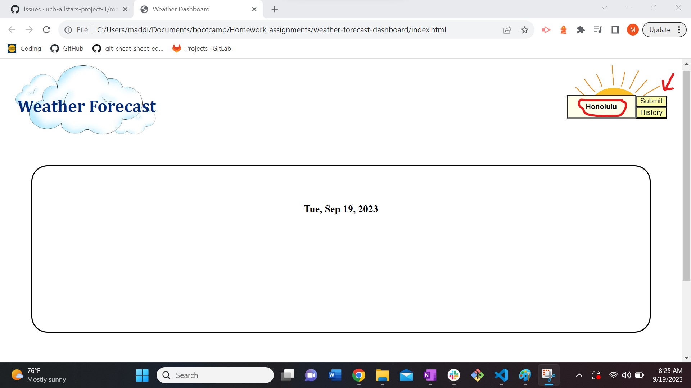
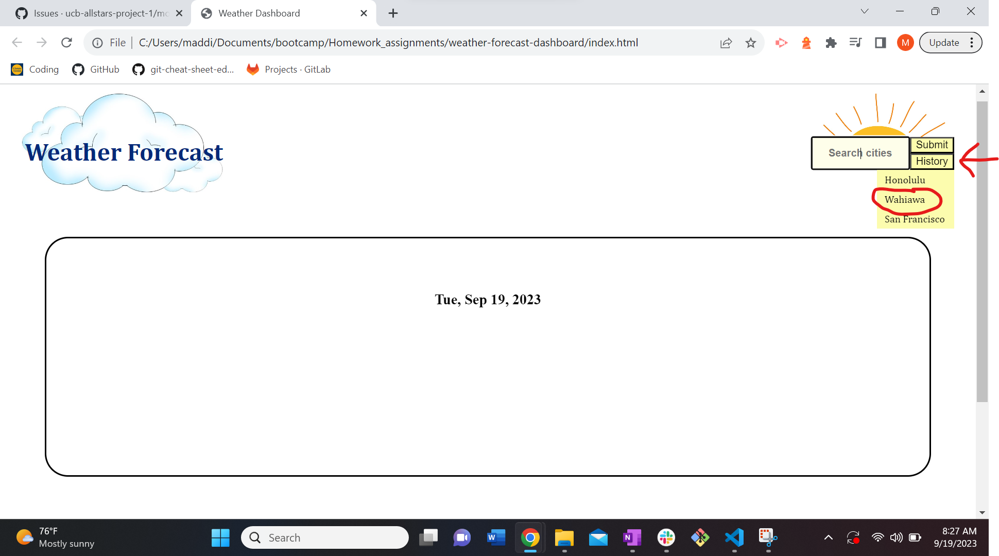
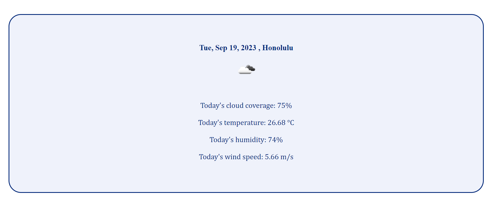
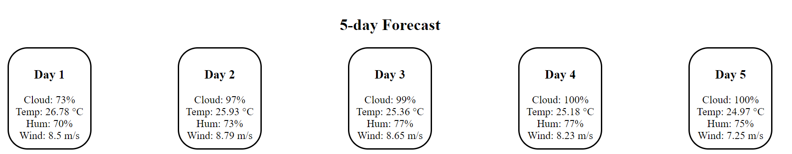

# weather-forecast-dashboard

https://maddieeckstrom.github.io/weather-forecast-dashboard/

## Description

The application is a weather forecast dashboard. Once a city is typed into the search box and submitted using the submit button, the day-of weather conditions and the following 5-day forecast will show for the city the user selected. If a user would like the forecast for a city they have previously searched for, they may click on that city existing in a history dropdown menu.

This application was built to act as an easy-to-use weather forecast application with a simple user interface and no advertisements for user's wanting to access the weather forecast without being bombarded by pop-ups.

In building this application I better learned how to fetch API data and collect whichever data strings from the fetched array was necessary to complete my application.

## Installation

The application is a live site and is ready-to-use with no installation needed.

## Usage

To search for a new city, type it in the search bar and hit the submit button, as shown in the screenshot:

To search for a city that has already been submitted, click on that city from the dropdown menu that exists when one scrolls over the history button, as shown in the screenshots:

Once a city has been either searched for or clicked on, the weather forecast will display, as shown in the following two screenshots:

## Credits

I used the following API: https://openweathermap.org/forecast5 
